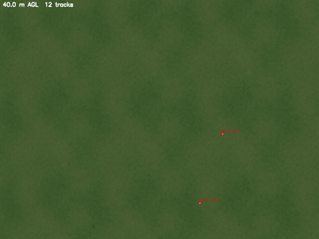
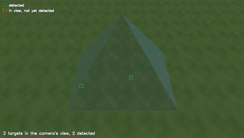
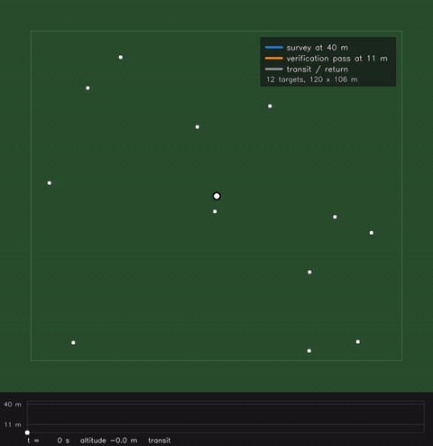

# UAV detect-and-track: survey high, verify low

An end-to-end autonomy stack for a small quadrotor, in ROS 2 and Gazebo, that flies the two-stage
search profile from my Remote Sensing paper (Loewenich et al. 2026): survey a field at 40 m, detect
and geolocate small target objects with a YOLOv9-C detector trained on real drone imagery, then
descend once to 11 m and hop between the candidates to verify each one. PX4 flies the mission
through MAVROS, the perception runs on the autopilot's own state estimate, and every run is scored
against the world's ground truth.

The paper's deliverable is a decision table for mission planning. This repository is the step after
it: the two-stage strategy as a mission a real autopilot flies, with the verification overheads that
the paper's section 5.2 sets aside made measurable.



> Scope: a civilian aerial-robotics demo (search and rescue, conservation, agriculture, survey
> planning). The perception code is airframe-agnostic. The control action sits behind an interface
> so a fixed-wing variant can follow. Public data only.

## What it shows, and what it does not

The paper argues, from a probabilistic model over target density and detector false-positive rate,
that a fast high survey followed by low verification of the flagged spots beats a constant low
survey in sparse fields (a 46% saving there, a 22% penalty in dense fields, crossover at a density
of 0.48 per grid cell). That model and its decision table live in the companion repository listed
under See also. This repository does not rerun it.

What this repository shows is that the profile works as a flying system:

- A real autopilot stack executes the sweep, the single descent and the hops from takeoff to
  landing, within set speed and tilt limits.
- The perception chain from pixels to ground coordinates, tiled detection, geolocation from the
  autopilot's state estimate and a ground-plane tracker, finds the target objects from 40 m and
  places them to within a few tens of centimetres.
- The verification pass does its job: on the dense field it rejected the one false track the
  survey had raised.
- The mission can also fly the paper's baseline, a constant survey of the whole field at 11 m
  (`VERIFY=false SURVEY_ALT=11`), for cost comparisons.
- Everything runs from a clean checkout, including a headless CI run.

Each result below is a single flight, on rendered grass, with simulated sensors. It is a
demonstration of the system, not a measurement of real-world recall or a statistical test of the
paper's claim.

## Results

| | Sparse field (12 targets, 9.4 per ha) | Dense field (60 targets, 47 per ha) |
|---|---|---|
| Survey recall / precision | 1.00 / 1.00 | 0.98 / 0.98 |
| Targets found on the survey (TP / FP / FN) | 12 / 0 / 0 | 59 / 1 / 1 |
| Verified true / rejected | 12 / 0 | 58 / 1 |
| Verified recall / precision | 1.00 / 1.00 | 0.97 / 1.00 |
| Geolocation error, mean / max (m) | 0.21 / 0.35 | 0.20 / 0.41 |
| Survey leg / verification pass (s) | 58 / 160 | 58 / 530 |
| Mission time, takeoff to landing (s) | 251 | 620 |

One mission per world, flown on 2026-09-17, so the recall figures are single-flight outcomes rather
than statistics. The verification pass dominates the mission time: each hop carries a transit at
5 m/s, a settle and a dwell of at least three camera frames, about 13 s per candidate.

Field 120 x 106.4 m, sized so that two survey passes at 40 m with 10% side overlap cover it exactly
(56 m swath, 50.4 m spacing), following the sweep model of the paper's section 3.2.4: a pass spans
only the centres of its first and last footprints, so the aircraft turns when the footprint reaches
the boundary. Survey at 5 m/s, one frame per second. Verify at 11 m with one descent and hops
between candidates ordered nearest-neighbour (the paper uses a TSP solver). Ground truth from the
world generator's manifest. A track counts as correct within 2 m of an unmatched target object on the survey
and within 1 m at verification. Full tables: `docs/results/sparse.md`, `docs/results/dense.md`.

Detector: YOLOv9-C fine-tuned on real DJI Mini 4 Pro frames of target objects on grass at 11, 15 and
40 m (Loewenich et al. 2026), run on 640 px tiles at native resolution, FP16 on an RTX 2070.
Geolocation uses the autopilot's own position and attitude estimate through MAVROS, not the
simulator's ground truth, so the errors above include estimator error.

## How it works

```
Gazebo Garden ─ x500 quad + nadir 4032x3024 camera ─┐
PX4 SITL v1.15.4 (attached to that model) ──────────┤ MAVROS ── mission node (survey planner,
ros_gz bridge (camera, clock, ground-truth odometry) ┘            single-descent verify pass,
                                                                  PX4 offboard through a
perception node: tiled YOLO ─► pixel-to-ground geolocation ─►     FlightController interface)
                 ground-plane tracker (distance association,
                 duplicate merging) ─► tracks, verdicts, JSONL log ─► scripts/score.py
```

- `uav_dt/`: detector, geolocation, tracker, pipeline, mission state machine, controller adapters. Numpy only apart from the detector. 28 unit tests.
- `ros2_ws/src/uav_dt_ros/`: `sim.launch.py` (Gazebo, spawn, PX4, MAVROS, bridges) and `mission.launch.py` (perception, mission, optional recording).
- `sim/`: world generator with a JSON ground-truth manifest, camera and target object models, procedural grass.
- `scripts/`: `setup.sh`, `env.sh`, `smoke.sh`, `score.py`, `record_video.py`, `replay_follow.py`, `install_mavros.sh`.
- `tools/`: world and texture generators, `flight_path_video.py` (top-down path animation), `annotate_follow.py`, `video_smoothness.py`.
- `detect_track.py`: standalone detect-and-track CLI for recorded video, independent of ROS and the simulator.

## Video

A mission records the annotated nadir view live. The third-person clips are rendered afterwards by
`scripts/replay_follow.py`, which replays the logged 50 Hz trajectory in a sim whose only sensor is
the follow camera, runs the world below real time so the renderer keeps up, and takes the frames
from the camera's own PNG output rather than a topic, so no frame is dropped or repeated. The survey
camera's field of view is drawn as a translucent cone ending at its footprint. `tools/flight_path_video.py` animates the flight path with
the survey and the verification pass in different colours. The clips are generated with the
scripts below from a recorded run. Two excerpts:





```bash
python3 scripts/replay_follow.py --run runs/sparse --world bowl_field_sparse --distance 16 --height 11 --pitch-deg 47
python3 tools/flight_path_video.py --run runs/sparse --world bowl_field_sparse --out flight_path.mp4
```

## Run it

```bash
scripts/setup.sh                       # once, see docs/setup.md for the pinned versions
source scripts/env.sh
python3 -m pytest && python3 smoke_test.py  # inside the venv that setup.sh creates
scripts/smoke.sh                       # headless, oracle detector, about 4 minutes, no weights needed
# real detector (weights in models/, see models/README.md), MAVROS pose, recording:
DETECTOR=yolo POSE=mavros RECORD=true MAX_VERIFY=0 MIN_RECALL=0 RUN_NAME=sparse scripts/smoke.sh
# CAMERA_HZ=0.5 halves the render and inference load. FRAME_STRIDE=2 skips every second survey frame
# VERIFY=false SURVEY_ALT=11 flies the constant 11 m survey baseline
python3 scripts/score.py runs/sparse/perception.jsonl sim/worlds/bowl_field_sparse.json
```

`ros2 launch uav_dt_ros sim.launch.py headless:=false` opens the Gazebo GUI.

## Scope and limitations

- Simulation only, so far. The real airframes run ArduPilot. The MAVROS-based controller keeps the swap to an ArduPilot adapter small, but that is unflown.
- The camera is body-fixed. Frames tilted beyond 20 degrees are skipped, which a gimbal would make unnecessary.
- Flat ground is assumed for geolocation.
- The grass is a procedural texture. The detector was trained on real turf and transferred without retraining, but this is not a claim about real-world recall.
- The workstation's thermal limits shaped some choices (FP16 inference, a 1 Hz survey camera, optional frame skipping). See docs/setup.md.

## Tech

Python, numpy, PyTorch, Ultralytics, ROS 2 Humble, Gazebo Garden, PX4 SITL 1.15.4, MAVROS 2.14, ffmpeg.

## See also

- [roguebytes/uav-survey-strategy-simulation](https://github.com/roguebytes/uav-survey-strategy-simulation): the Monte Carlo model and the decision table behind the paper.
- [roguebytes/uav-survey-strategy-dataset](https://github.com/roguebytes/uav-survey-strategy-dataset): the field imagery, annotations, detector weights and predictions at 11, 15 and 40 m.

## Reference

Loewenich, F., Maire, F., Sandino, J., & Gonzalez, F. (2026). Fly High or Fly Low? Selecting
Time-Efficient UAV Search Strategies for High-Recall Aerial Detection. *Remote Sensing*, 18(18),
3129. https://doi.org/10.3390/rs18183129

## License

MIT. The replay quad models derive from PX4's x500 model under the BSD 3-Clause License, see
`sim/models/THIRD_PARTY_NOTICES.md`.
